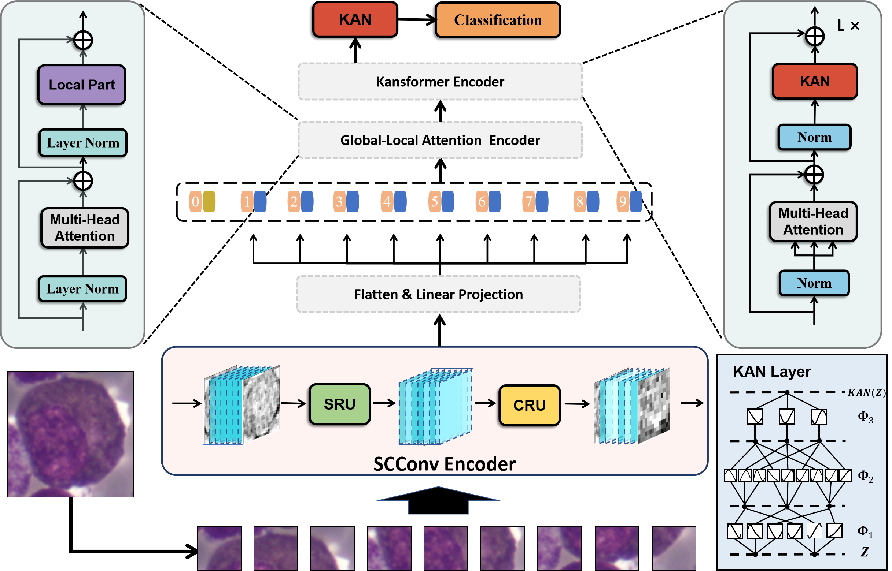

# SCKansformer

We propose a novel fine-grained classification model, SCKansformer, for bone marrow blood cells. The SCKansformer model primarily comprises three parts: Kansformer Encoder, SCConv Encoder and Global-Local Attention Encoder. The overall architecture of our proposed SCKansformer model: 


## 1. Environment

- Please clone this repository and navigate to it in your terminal.
- Then prepare an environment with python=3.8, and then use the command `pip install -r requirements.txt` for the dependencies.

## 2. Train/Test

- Put the BMCD-FGCD dataset(PBC/ALL-IDB dataset) into data/BM_data(PBC_data/ALL_data)
- Run `train_SCkansformer_cell.py` to Train/Test in data/BM_data (Put the dataset into data first)
- The batch size we used is 40 for V100. If you do not have enough GPU memory, the bacth size can be reduced to 30 for GeForce RTX 4090 or 6 to save memory.

## 3. BMCD-FGCD dataset

In collaboration with the Department of Hematology at Zhejiang Hospital in Hangzhou, Zhejiang Province, our team has established the Bone Marrow Cell Dataset for Fine-Grained Classification (BMCD-FGCD),
containing over 10,000 data points across nearly forty classifications. We have made our private BMCD-FGCD dataset available to other researchers, contributing to the field's advancement.
If you want to use our relabelled dataset, please cite our article.

## 4. Establishment and Usage of our BMCD-FGCD dataset

**Workflow of the establishment of our BMCD-FGCD dataset:**


**Below, we delineate the specific utility of our BMCD-FGCD dataset in various application contexts:**

- Training of Deep Learning Models and Automatic Blood Cell Identification.
- Integrated Diagnosis with Clinical Data.
- Identification of Rare and Atypical Blood Cells.

## 5. Citation

```
@article{chen2024sckansformer,
  title={SCKansformer: Fine-Grained Classification of Bone Marrow Cells via Kansformer Backbone and Hierarchical Attention Mechanisms},
  author={Chen, Yifei and Zhu, Zhu and Zhu, Shenghao and Qiu, Linwei and Zou, Binfeng and Jia, Fan and Zhu, Yunpeng and Zhang, Chenyan and Fang, Zhaojie and Qin, Feiwei and others},
  journal={arXiv preprint arXiv:2406.09931},
  year={2024}
}
```
